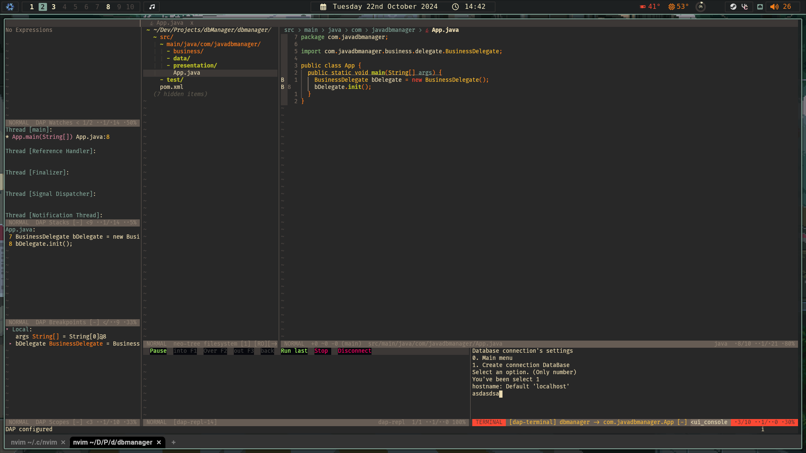
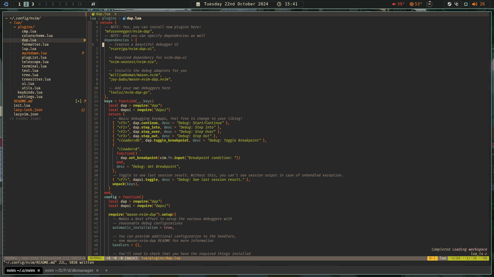
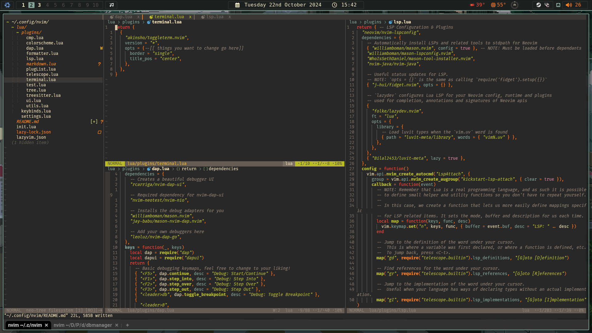
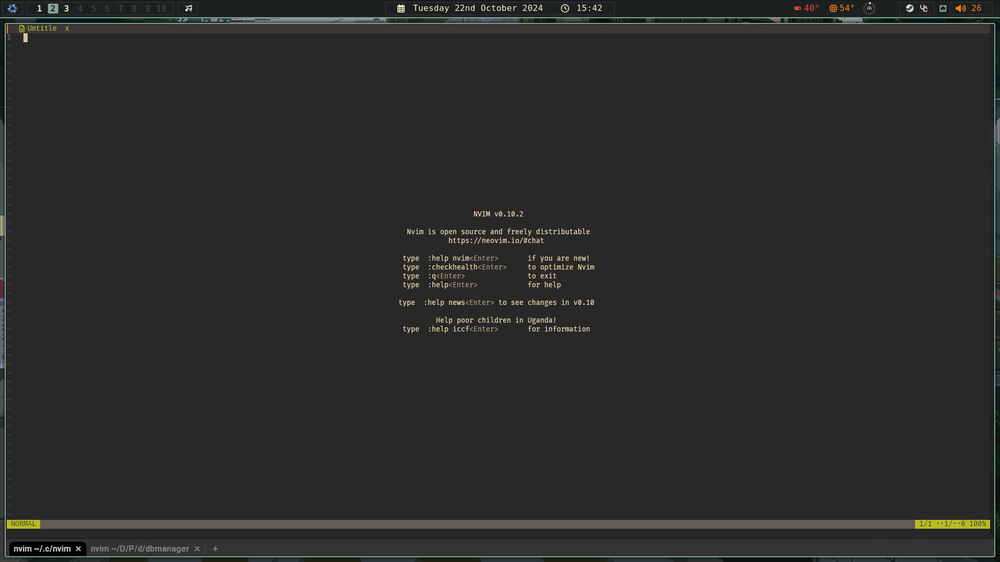

# Estebandev Neovim Classic - Style

## Features

- Classic UI
- Tree for files
- Telescope (Find files, symbols, words, git files)
- LSP (Mason, Intellisense menu, autocomplete, see documentation, go to definition.. etc)
- Testing Environment (Neotest)
- Autoformatting
- [nvim-java support](https://github.com/nvim-java/nvim-java)


## Install

```bash
mv ~/.config/nvim ~/.config/nvim.old \
rm -rf ~/.local/state/nvim \
rm -rf ~/.local/share/nvim \
git clone https://github.com/Esteban528/nvim.git ~/.config/ \
cd ~/.config/nvim && nvim
```

## Uninstall

```bash
rm -rf ~/.config/nvim ~/.config/nvim.old \
rm -rf ~/.local/state/nvim \
rm -rf ~/.local/share/nvim \
```

## Screenshots





